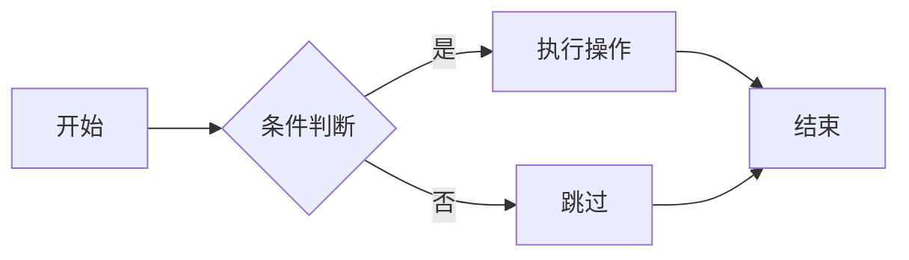
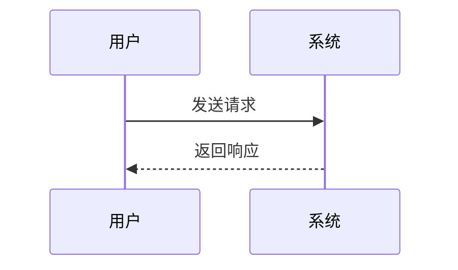

你是看到了我们的术语构建的这个术语新建的这个项目，它是脚本存在问题吗？而且当前你已经全部修复了吗？我们是没有这些版本译本，你才去填写的其他的吗？
# 验收测试文章

本文档用于 Social Studio 渲染管线重构的验收测试，覆盖所有支持的内容类型。

## 正文类型

这是普通段落。**这是加粗文本**。*这是斜体文本*。~~这是删除线~~。==这是高亮==。

这是包含 `行内代码` 的段落。这是 [链接](https://example.com)。

## 列表
	
### 无序列表

- 无序列表项 1
- 无序列表项 2
  - 嵌套项 2.1
  - 嵌套项 2.2
- 无序列表项 3

### 有序列表

1. 有序列表项 1
2. 有序列表项 2
   1. 嵌套项 2.1
   2. 嵌套项 2.2
3. 有序列表项 3

### 任务列表

- [x] 已完成任务
- [ ] 未完成任务

## 表格

| 列1 | 列2 | 列3 |
|-----|:---:|----:|
| A   | B   | C   |
| 左对齐 | 居中 | 右对齐 |
| 长文本测试 | 长文本测试 | 长文本测试 |

## 代码块

### Python

```python
def hello_world():
    """Hello world function."""
    message = "Hello, World!"
    print(message)
    return message

class Greeter:
    def __init__(self, name):
        self.name = name
    
    def greet(self):
        return f"Hello, {self.name}!"
```

### JavaScript

```javascript
async function fetchData(url) {
  const response = await fetch(url);
  if (!response.ok) {
    throw new Error(`HTTP error: ${response.status}`);
  }
  return response.json();
}
```

## Callout

> [!note] 笔记标题
> 这是一个笔记类型的 callout。内容支持多行。

> [!warning] 警告标题
> 这是一个警告类型的 callout。

> [!tip] 提示标题
> 这是一个提示类型的 callout。

## 数学公式

### 行内公式

质能方程 $E=mc^2$ 是物理学最著名的公式之一。

欧拉公式 $e^{i\pi} + 1 = 0$ 被誉为最美的数学公式。

### 块级公式

$$
\int_0^1 f(x) \, dx = F(1) - F(0)
$$

$$
\sum_{n=1}^{\infty} \frac{1}{n^2} = \frac{\pi^2}{6}
$$

矩阵公式：

$$
\begin{bmatrix}
a & b \\
c & d
\end{bmatrix}
\begin{bmatrix}
x \\
y
\end{bmatrix}
=
\begin{bmatrix}
ax + by \\
cx + dy
\end{bmatrix}
$$

## Mermaid 图表

### 流程图



### 时序图



## HTML Artifact

### 仪表盘卡片

```html
<div style="display: flex; gap: 16px; padding: 20px; background: linear-gradient(135deg, #667eea 0%, #764ba2 100%); border-radius: 12px; color: white;">
  <div style="flex: 1; padding: 16px; background: rgba(255,255,255,0.15); border-radius: 8px; backdrop-filter: blur(10px);">
    <div style="font-size: 12px; opacity: 0.8;">总用户数</div>
    <div style="font-size: 28px; font-weight: bold;">12,345</div>
    <div style="font-size: 11px; color: #4ade80;">↑ 12.5%</div>
  </div>
  <div style="flex: 1; padding: 16px; background: rgba(255,255,255,0.15); border-radius: 8px; backdrop-filter: blur(10px);">
    <div style="font-size: 12px; opacity: 0.8;">活跃用户</div>
    <div style="font-size: 28px; font-weight: bold;">3,456</div>
    <div style="font-size: 11px; color: #f87171;">↓ 3.2%</div>
  </div>
</div>
```

### 进度条

```html
<div style="padding: 16px; background: #f8f9fa; border-radius: 8px;">
  <div style="margin-bottom: 8px; font-weight: 600;">项目进度</div>
  <div style="background: #e9ecef; border-radius: 4px; overflow: hidden; height: 24px;">
    <div style="width: 75%; background: linear-gradient(90deg, #4facfe 0%, #00f2fe 100%); height: 100%; display: flex; align-items: center; justify-content: center; color: white; font-size: 12px; font-weight: bold;">75%</div>
  </div>
</div>
```

## SVG

### 简单图形

```svg
<svg width="200" height="100" viewBox="0 0 200 100" xmlns="http://www.w3.org/2000/svg">
  <circle cx="50" cy="50" r="40" fill="#3498db" opacity="0.8"/>
  <rect x="100" y="10" width="80" height="80" fill="#e74c3c" opacity="0.8" rx="8"/>
  <text x="100" y="55" fill="white" font-size="14">SVG</text>
</svg>
```

### 图标

```svg
<svg width="48" height="48" viewBox="0 0 24 24" fill="none" xmlns="http://www.w3.org/2000/svg">
  <path d="M12 2L2 7l10 5 10-5-10-5z" fill="#3498db"/>
  <path d="M2 17l10 5 10-5M2 12l10 5 10-5" stroke="#3498db" stroke-width="2" fill="none"/>
</svg>
```

## 引用

> 这是一段引用文本。
> 
> 引用可以包含多行。

## 分隔线

---

## 脚注

这段文本有一个脚注[^1]。

[^1]: 这是脚注内容。

## 总结

如果以上所有内容类型在预览和发布中都渲染正确，则验收通过。

## 重构后新增验收项

以下验收项覆盖 v0.2.0 重构后的新行为。

### CSS 变量内联

预览区允许 CSS 变量（浏览器可解析），发布时必须内联为具体值。下方卡片中的标题应为红色（`#ff6b6b`），正文为深灰色。

```html
<style>
.css-var-demo { border: 2px solid #ff6b6b; border-radius: 8px; padding: 16px; margin: 16px 0; background: #fff5f5; }
.css-var-demo h4 { color: var(--custom-color); margin: 0 0 8px 0; }
.css-var-demo p { color: var(--text-color); margin: 0; font-size: 14px; }
</style>
<div style="--custom-color: #ff6b6b; --text-color: #333;">
  <div class="css-var-demo">
    <h4>CSS 变量测试卡片</h4>
    <p>预览时标题为红色（浏览器解析 var()），发布时 juice 内联为 #ff6b6b。</p>
  </div>
</div>
```

### 伪元素保留

发布时 `::before`/`::after` 伪元素应被预处理为真实 DOM 元素。下方卡片左右两侧应显示箭头符号（→ 和 ←）。

```html
<style>
.pseudo-demo { border: 2px solid #448aff; border-radius: 8px; padding: 16px; margin: 16px 0; background: #f0f6fc; text-align: center; font-size: 16px; font-weight: 600; }
</style>
<div data-before="→" data-after="←" style="--before-content: '→'; --after-content: '←';">
  <div class="pseudo-demo">伪元素测试：左右应有箭头</div>
</div>
```

### artifact 独立渲染

HTML artifact 的 `<style>` 标签在预览时保留，发布时 CSS 内联但 class 保留。下方卡片应有圆角边框和内边距。

```html
<style>
.artifact-card { border: 2px solid #e0e0e0; border-radius: 12px; padding: 20px; margin: 16px 0; background: #fafafa; }
.artifact-card .title { font-size: 18px; font-weight: 700; color: #333; margin-bottom: 12px; }
.artifact-card .body { font-size: 14px; color: #666; line-height: 1.6; }
</style>
<div class="artifact-card">
  <div class="title">带 style 标签的 artifact</div>
  <div class="body">这个 artifact 有独立的 &lt;style&gt; 标签。预览时浏览器原生渲染，发布时 juice 内联到元素 style 属性。</div>
</div>
```

### 嵌套列表结构

微信发布时嵌套列表的 `<ul>` 应在 `<li>` 后面而非内部。

- 一级项目
  - 二级项目
  - 二级项目 B
- 一级项目 B

### 链接脚注格式

微信发布时链接转为脚注格式，知乎保留原始链接。

[Social Studio GitHub](https://github.com/dhammavipassi/social-studio-obsidian)

### 结束标记

SS-ACCEPT-MATRIX-V2
