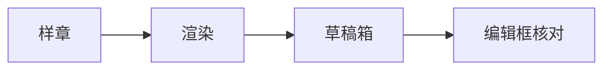
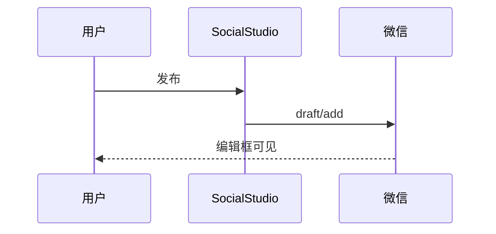

# Social Studio 微信验收总样章

> 用途：T2 草稿箱复验。推送后请在草稿**编辑框**核对各节，不得仅看预览。

## A. 代码块

```javascript
function greet(name) {
  // 期望：Mac 圆点 + 行号 + 语法高亮（inline style）
  return `Hello, ${name}`;
}
console.log(greet("微信"));
```

```python
def add(a, b):
    """期望语言标签 python 可见"""
    return a + b
```

## B. 数学公式

行内公式：$E = mc^2$

块级公式：

$$
\int_{0}^{1} x^2 \, dx = \frac{1}{3}
$$

## C. Mermaid





## D. Callout / 列表 / 高亮

> [!note] 验收说明
> 此 callout 应保留结构与颜色风格。

- [x] 任务已完成
- [ ] 任务未完成

这是 ==高亮文本== 与 **加粗**、*斜体*。

## E. 表格

| 维度 | 期望 |
|------|------|
| 对齐 | 正常 |
| 边框 | 微信可读 |

## F. 图片与标题


期望：图片可上传到微信 CDN；标题/说明若支持 figcaption 则显示。

## G. 链接与脚注

正文链接 [微信开放文档](https://developers.weixin.qq.com/) 应按设置转为脚注或保留。

## 结束标记

`SS-ACCEPT-MATRIX-V1`
