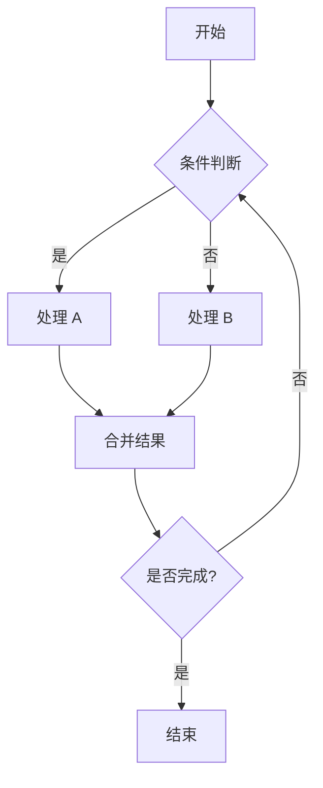
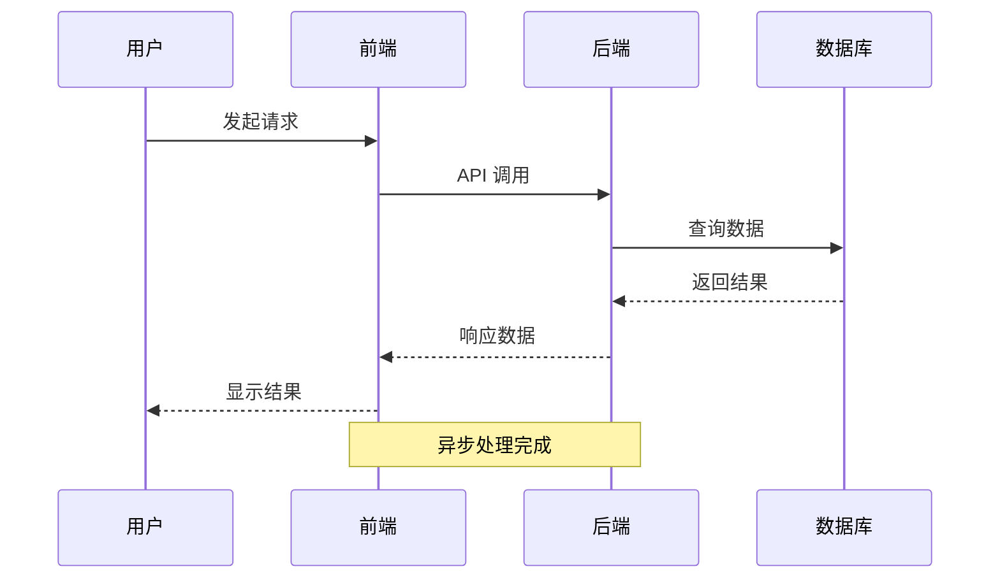
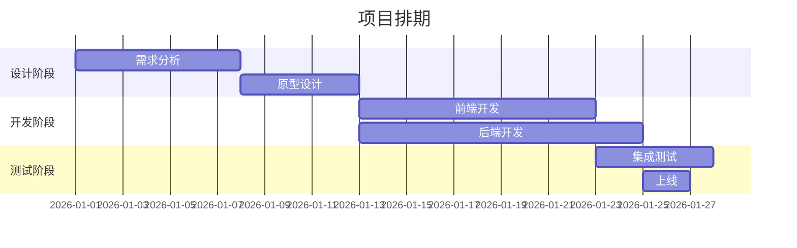
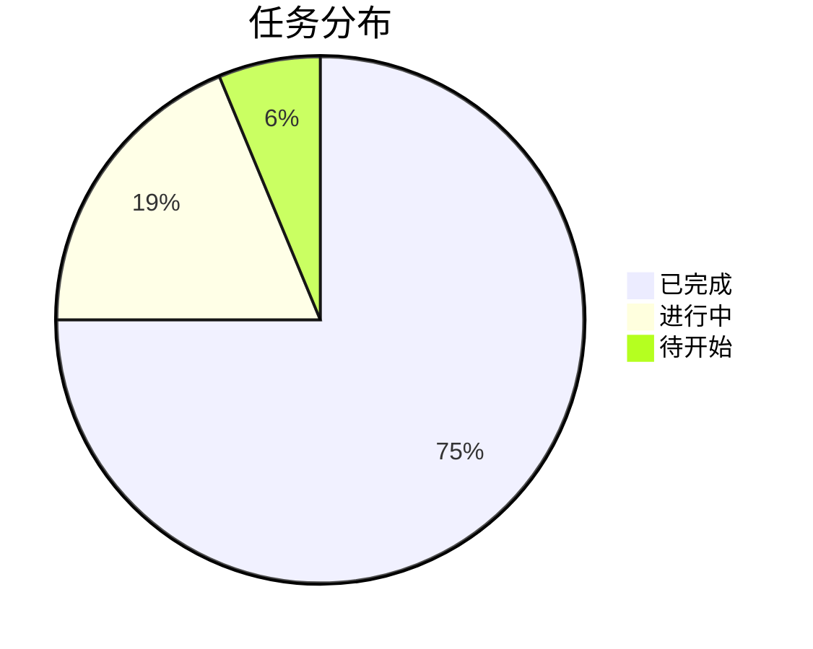
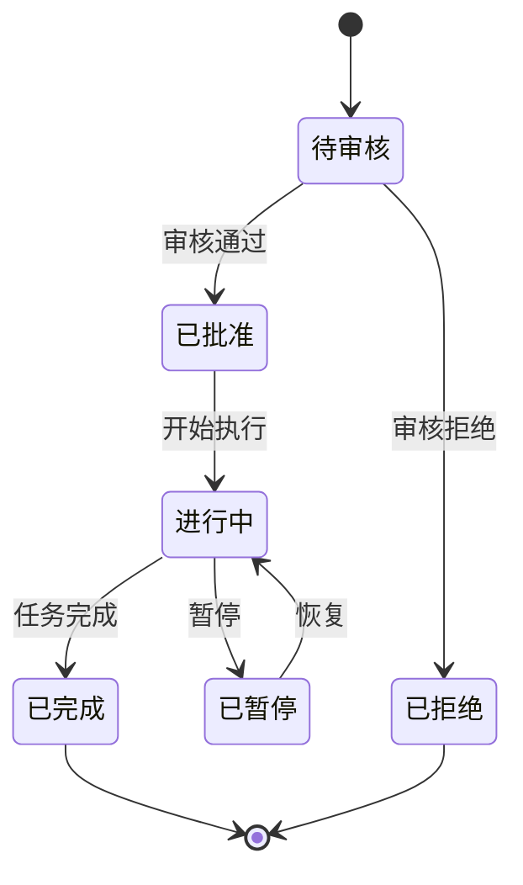

---
publish_records:
  - platform: wechat-official
    content_id: vPo8I0b7U8-ZnqUK8-p8LQSmJq10ymT4TXWibSn8Q5UZv_0nEePY4-gzHasH9Q2X
    url: https://mp.weixin.qq.com
    date: 2026-08-16T02:44:29.801Z
    status: success
title: "Social Studio 压力测试矩阵"
tags: []
description: "> 本文件用于全面测试 Social Studio 预览渲染管线的健壮性。 > 包含：复杂 HTML、SVG、Mermaid（多种图型）、数学公式、嵌套结构、表格、Callout、代码块。 A. 复杂 HTML 仪表盘 B. 复杂 SVG 图形 C. Mermaid 多图型测试 C.1 流程图（flowchart） C.2 时序图（sequenceDiagram） C.3 甘特图（gantt） C"
draft: false
publishDate: "2026-08-16"
---

# Social Studio 压力测试矩阵

> 本文件用于全面测试 Social Studio 预览渲染管线的健壮性。
> 包含：复杂 HTML、SVG、Mermaid（多种图型）、数学公式、嵌套结构、表格、Callout、代码块。

## A. 复杂 HTML 仪表盘

```html
<!DOCTYPE html>
<html lang="zh-CN">
<head>
<meta charset="UTF-8">
<style>
:root {
  --bg:#1a1a2e; --card:#16213e; --accent:#0f3460; --text:#e0e0e0;
  --highlight:#e94560; --success:#00b894; --warn:#fdcb6e;
}
* { margin:0; padding:0; box-sizing:border-box; }
body { background:var(--bg); color:var(--text); font-family:-apple-system,sans-serif; padding:20px; }
.dashboard { display:grid; grid-template-columns:repeat(3,1fr); gap:16px; margin-bottom:20px; }
.stat-card { background:var(--card); border-radius:12px; padding:20px; border-left:4px solid var(--highlight); }
.stat-card.success { border-left-color:var(--success); }
.stat-card.warn { border-left-color:var(--warn); }
.stat-value { font-size:32px; font-weight:700; margin:8px 0; }
.stat-label { font-size:12px; opacity:0.7; text-transform:uppercase; letter-spacing:1px; }
.progress-bar { height:6px; background:rgba(255,255,255,0.1); border-radius:3px; overflow:hidden; margin-top:12px; }
.progress-fill { height:100%; background:var(--highlight); border-radius:3px; transition:width 1s ease; }
.progress-fill.success { background:var(--success); }
.chart-container { background:var(--card); border-radius:12px; padding:24px; margin-bottom:20px; }
.chart-title { font-size:18px; font-weight:600; margin-bottom:16px; }
.bar-chart { display:flex; align-items:flex-end; gap:8px; height:120px; padding-top:20px; }
.bar { flex:1; background:var(--accent); border-radius:4px 4px 0 0; position:relative; transition:height 0.5s; }
.bar:hover { background:var(--highlight); }
.bar-label { position:absolute; bottom:-24px; left:50%; transform:translateX(-50%); font-size:11px; opacity:0.6; }
.bar-value { position:absolute; top:-20px; left:50%; transform:translateX(-50%); font-size:11px; font-weight:600; }
table { width:100%; border-collapse:collapse; margin-top:16px; }
th { text-align:left; padding:12px; background:var(--accent); border-radius:4px; font-size:13px; }
td { padding:12px; border-bottom:1px solid rgba(255,255,255,0.05); font-size:13px; }
.badge { display:inline-block; padding:2px 10px; border-radius:12px; font-size:11px; font-weight:600; }
.badge.active { background:rgba(0,184,148,0.2); color:var(--success); }
.badge.pending { background:rgba(253,203,110,0.2); color:var(--warn); }
.badge.failed { background:rgba(233,69,96,0.2); color:var(--highlight); }
@media (max-width:600px) {
  .dashboard { grid-template-columns:1fr; }
}
</style>
</head>
<body>
<div class="dashboard">
  <div class="stat-card">
    <div class="stat-label">总任务</div>
    <div class="stat-value">128</div>
    <div class="progress-bar"><div class="progress-fill" style="width:75%"></div></div>
  </div>
  <div class="stat-card success">
    <div class="stat-label">已完成</div>
    <div class="stat-value">96</div>
    <div class="progress-bar"><div class="progress-fill success" style="width:75%"></div></div>
  </div>
  <div class="stat-card warn">
    <div class="stat-label">进行中</div>
    <div class="stat-value">32</div>
    <div class="progress-bar"><div class="progress-fill" style="width:25%; background:var(--warn)"></div></div>
  </div>
</div>
<div class="chart-container">
  <div class="chart-title">周度任务完成趋势</div>
  <div class="bar-chart">
    <div class="bar" style="height:60%"><span class="bar-value">12</span><span class="bar-label">周一</span></div>
    <div class="bar" style="height:80%"><span class="bar-value">16</span><span class="bar-label">周二</span></div>
    <div class="bar" style="height:45%"><span class="bar-value">9</span><span class="bar-label">周三</span></div>
    <div class="bar" style="height:90%"><span class="bar-value">18</span><span class="bar-label">周四</span></div>
    <div class="bar" style="height:70%"><span class="bar-value">14</span><span class="bar-label">周五</span></div>
    <div class="bar" style="height:30%"><span class="bar-value">6</span><span class="bar-label">周六</span></div>
    <div class="bar" style="height:20%"><span class="bar-value">4</span><span class="bar-label">周日</span></div>
  </div>
</div>
<div class="chart-container">
  <div class="chart-title">任务状态明细</div>
  <table>
    <thead><tr><th>任务名</th><th>状态</th><th>优先级</th><th>完成率</th></tr></thead>
    <tbody>
      <tr><td>渲染管线重构</td><td><span class="badge active">进行中</span></td><td>高</td><td>75%</td></tr>
      <tr><td>Mermaid 修复</td><td><span class="badge active">已完成</span></td><td>高</td><td>100%</td></tr>
      <tr><td>数学公式修复</td><td><span class="badge active">已完成</span></td><td>中</td><td>100%</td></tr>
      <tr><td>HTML 仪表盘</td><td><span class="badge pending">待验证</span></td><td>中</td><td>50%</td></tr>
      <tr><td>性能优化</td><td><span class="badge failed">阻塞</span></td><td>低</td><td>0%</td></tr>
    </tbody>
  </table>
</div>
</body>
</html>
```

## B. 复杂 SVG 图形

```svg
<svg width="400" height="300" xmlns="http://www.w3.org/2000/svg">
  <defs>
    <linearGradient id="grad1" x1="0%" y1="0%" x2="100%" y2="0%">
      <stop offset="0%" style="stop-color:#e94560;stop-opacity:1" />
      <stop offset="100%" style="stop-color:#0f3460;stop-opacity:1" />
    </linearGradient>
    <filter id="blur1">
      <feGaussianBlur in="SourceGraphic" stdDeviation="3" />
    </filter>
  </defs>
  <rect x="10" y="10" width="380" height="280" rx="12" fill="#16213e" />
  <circle cx="100" cy="100" r="50" fill="url(#grad1)" opacity="0.8" />
  <circle cx="200" cy="100" r="50" fill="#e94560" opacity="0.6" filter="url(#blur1)" />
  <circle cx="300" cy="100" r="50" fill="#0f3460" stroke="#e94560" stroke-width="3" />
  <path d="M 50 200 Q 200 150 350 200 T 350 250" stroke="#e94560" stroke-width="2" fill="none" />
  <text x="200" y="270" text-anchor="middle" fill="#e0e0e0" font-size="14">SVG 压力测试</text>
</svg>
```

## C. Mermaid 多图型测试

### C.1 流程图（flowchart）



### C.2 时序图（sequenceDiagram）



### C.3 甘特图（gantt）



### C.4 饼图（pie）



### C.5 状态图（stateDiagram-v2）



## D. 数学公式

### D.1 行内公式

质能方程 $E = mc^2$，欧拉公式 $e^{i\pi} + 1 = 0$，高斯积分 $\int_{-\infty}^{\infty} e^{-x^2} dx = \sqrt{\pi}$。

### D.2 块级公式

$$\frac{\partial \mathcal{L}}{\partial \theta} = \frac{1}{N} \sum_{i=1}^{N} \nabla_\theta \log p(y_i | x_i; \theta)$$

$$\mathbf{A} = \begin{pmatrix} a_{11} & a_{12} & a_{13} \\ a_{21} & a_{22} & a_{23} \\ a_{31} & a_{32} & a_{33} \end{pmatrix}$$

## E. 嵌套结构

> [!note] 外层 Callout
> > [!warning] 内层 Callout
> > 嵌套内容测试

- 第一层
  - 第二层
    - 第三层
      - 第四层
  - 回到第二层
- 回到第一层

## F. 代码块

```python
def fibonacci(n: int) -> list[int]:
    """生成斐波那契数列"""
    if n <= 0:
        return []
    if n == 1:
        return [0]
    fib = [0, 1]
    for i in range(2, n):
        fib.append(fib[i-1] + fib[i-2])
    return fib

# 测试
print(fibonacci(10))
```

## G. 表格

| 模块 | 状态 | 测试数 | 通过率 |
|------|------|--------|--------|
| 渲染管线 | ✅ | 45 | 100% |
| Mermaid | ✅ | 12 | 100% |
| 数学公式 | ✅ | 8 | 100% |
| HTML 后处理 | ✅ | 15 | 100% |
| 发布流程 | ⏳ | 20 | 85% |

<!-- SS-ACCEPT-STRESS-END -->
